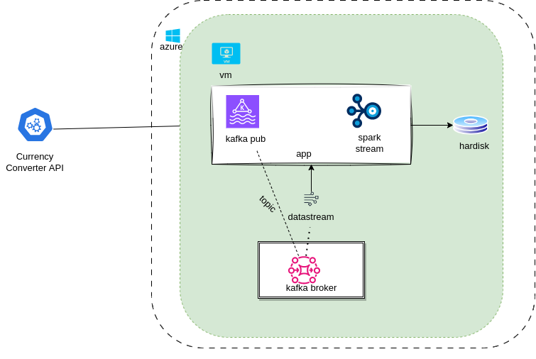

# CurrencyWatchLive
The CurrencyWatchLive application is designed to extract currency conversion rates in real-time. It utilizes various components such as Kafka for message queuing, Spark Streaming for real-time data processing, and Docker for containerization(indented for action.yaml).


## Prequisties

1. **Install az cli**
2. **Install the dependencies** using `scripts/install-dependencies.sh`.
3. **Start the Kafka broker** using `scripts/start_broker.sh`.
4. **Run the CurrencyWatchLive application** using `start-app.sh`.
5. **Monitor currency conversion rates** in real-time.
6. **Find the output conversion rates** in the `output_text/` directory.


### To start the program, follow these steps:

1. **Login to Azure Cloud**: Run the command `az login` in your terminal and follow the prompts to authenticate and log in to your Azure account.

2. **SSH to the Virtual Machine**: After logging in, SSH into the virtual machine using the following command:
   ```
   az network bastion ssh --name "fsm-bastion" --resource-group "datapipeline" --target-ip-addres "10.0.2.4"  --target-resource-id "/subscriptions/8733b2fa-eea7-41ea-9c8b-7fa437d9b675/resourceGroups/datapipeline/providers/Microsoft.Compute/virtualMachines/fsm-machine" --auth-type "ssh-key" --username "adminuser" --ssh-key "~/.ssh/id_rsa.pub"
   ```

3. **Clone the Repository**: Clone the CurrencyWatchLive repository from GitHub:
   ```
   git clone git@github.com:lazarchris/CurrencyWatchLive.git
   ```

4. **Navigate to the Repository Directory**: Change your current directory to CurrencyWatchLive:
   ```
   cd CurrencyWatchLive
   ```

5. **Create a Virtual Environment**: Create a Python virtual environment named `venv` using the following command:
   ```
   python3 -m venv venv
   ```

6. **Install Requirements**: Install the required Python packages by running:
   ```
   pip install -r requirements.txt
   ```

7. **Install Dependencies**: Run the script to install additional dependencies:
   ```
   ./scripts/install-dependencies.sh
   ```

8. **Start the Kafka Broker**: Run the script to start the Kafka broker:
   ```
   ./scripts/start-broker.sh
   ```

9. **Start the Application**: Finally, start the CurrencyWatchLive application by running:
   ```
   ./start-app.sh
   ```

## Components

- **app/**: Contains the main application code.
  - **kafka_publisher/**: Module responsible for publishing currency conversion data to Kafka.
  - **spark_streamer/**: Module responsible for streaming and processing currency conversion data using Spark.
  - **main.py**: Entry point for the application.
  - **settings.json**: Configuration file for the application.

- **output_text/**: Contains the output file(s) for the currency conversion rates.
  - **output_2024-02-11.txt**: Example output file for the currency conversion rates on February 11, 2024.

- **docker**: Defines the environment for Docker containerization.

- **requirements.txt**: Lists the dependencies required by the application.

- **scripts/**: Contains shell scripts for installing dependencies and starting the broker.

- **start-app.sh**: Shell script to start the CurrencyWatchLive application.

- **terraform/**: Terraform configuration files for deploying infrastructure on the cloud.
  - **bastion.tf**: Configuration for setting up a bastion host.
  - **networking.tf**: Configuration for networking components.
  - **provider.tf**: Provider configuration for Terraform.
  - **variables.tf**: Declaration of input variables for Terraform.
  - **virtual_machine.tf**: Configuration for virtual machines.


## Design



### Design Explanation

The CurrencyWatchLive application, running on an Azure Cloud VM, consists of several components working together:

1. **Currency API**:
   - This component represents the external service or API from which the application fetches currency conversion rates.
   - The Currency API may be hosted externally and accessed via HTTP requests from Azure VM.

2. **Kafka Broker**:
   - The Kafka Broker acts as an intermediary between the Currency API and the CurrencyWatchLive application.
   - The Currency API sends currency conversion rate data to the Kafka Broker.
   - The Kafka Broker stores this data temporarily and makes it available for consumption by the CurrencyWatchLive application.

3. **CurrencyWatchLive Application**:
   - This is the main application running on an Azure Cloud VM.
   - It consists of two main components:
      - **Kafka Topic Producer**: Responsible for publishing currency conversion rate data to a Kafka topic. It fetches data from the Currency API and sends it to the specified Kafka topic.
      - **Spark Stream Consumer**: Consumes currency conversion rate data from the Kafka topic using Apache Spark Streaming. It processes the incoming data in real-time, monitoring currency conversion rates continuously.

4. **Output Text Directory**:
   - The CurrencyWatchLive Application writes the output, i.e., the monitored currency conversion rates, to the VM's HDD.
   - It may write this data in the form of text files to a specific directory on the VM's local storage.
   - This directory could be any location accessible by the CurrencyWatchLive Application on the VM's filesystem.

5. **Azure Cloud VM**:
   - The entire application, including the CurrencyWatchLive Application, runs on a virtual machine hosted on the Azure cloud platform.
   - The VM provides the necessary compute resources and storage for running and storing the application and its output.

This design is used for processing and monitoring of currency conversion rate data, with the Currency API providing the initial data source, the Kafka Broker facilitating communication between components, and the CurrencyWatchLive Application performing real-time monitoring and output generation.

## Result
### App starting on the virtual machine on azure cloud


### App output
Currency exchange rates live


Ensure that you have the necessary permissions and configurations set up in your Azure account, and that you have replaced placeholders like `git@github.com:lazarchris/CurrencyWatchLive.git` with the actual repository URL.


## Developer Guide
1. The bastion server terraform configuration is not working currently. It is commented
2. As soon you create terraform using the configuration files, create a bastion server manually on the vm

[Other README](terraform/README.md)

### To be done
1. Implement a automated pipline 
2. Implement unit tests and actions.yaml
3. Write output to azure storage

# Author
Christy Lazar
christylazarac@gmail.com