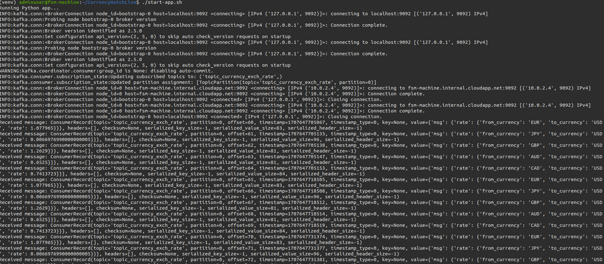
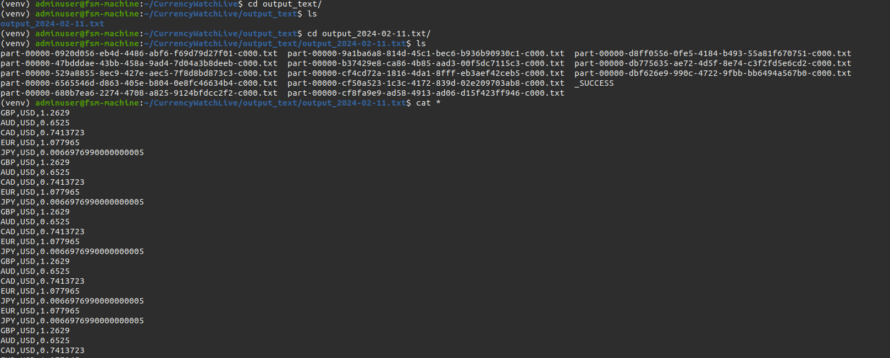

# CurrencyWatch Application Documentation
The CurrencyWatch application is designed to extract currency conversion rates in real-time. It utilizes various components such as Kafka for message queuing, Spark Streaming for real-time data processing, and Docker for containerization.

Thank you for providing that information. I'll update the documentation to include the directory where the conversion rates are written.

## Directory Structure

```
CurrencyWatchLive/
├── app
│   ├── __init__.py
│   ├── kafka_publisher
│   │   ├── api
│   │   │   ├── currency_converter.py
│   │   │   └── __init__.py
│   │   ├── consumer.py
│   │   ├── __init__.py
│   │   └── producer.py
│   ├── main.py
│   ├── settings.json
│   └── spark_streamer
│       ├── __init__.py
│       └── spark_streamer.py
├── Dockerfile
├── README.md
├── requirements.txt
├── scripts
│   ├── install-dependencies.sh
│   └── start_broker.sh
├── start-app.sh
└── terraform
    ├── bastion.tf
    ├── networking.tf
    ├── provider.tf
    ├── README.md
    ├── terraform.tfstate
    ├── terraform.tfstate.backup
    ├── variables.tf
    └── virtual_machine.tf
```

## Components

- **app/**: Contains the main application code.
  - **kafka_publisher/**: Module responsible for publishing currency conversion data to Kafka.
  - **spark_streamer/**: Module responsible for streaming and processing currency conversion data using Spark.
  - **main.py**: Entry point for the application.
  - **settings.json**: Configuration file for the application.

- **output_text/**: Contains the output file(s) for the currency conversion rates.
  - **output_2024-02-11.txt**: Example output file for the currency conversion rates on February 11, 2024.

- **Dockerfile**: Defines the environment for Docker containerization.

- **requirements.txt**: Lists the dependencies required by the application.

- **scripts/**: Contains shell scripts for installing dependencies and starting the broker.

- **start-app.sh**: Shell script to start the CurrencyWatch application.

- **terraform/**: Terraform configuration files for deploying infrastructure on the cloud.
  - **bastion.tf**: Configuration for setting up a bastion host.
  - **networking.tf**: Configuration for networking components.
  - **provider.tf**: Provider configuration for Terraform.
  - **variables.tf**: Declaration of input variables for Terraform.
  - **virtual_machine.tf**: Configuration for virtual machines.

## Usage

1. Ensure that Docker and Terraform are installed on your system.
2. Install the dependencies using `scripts/install-dependencies.sh`.
3. Start the Kafka broker using `scripts/start_broker.sh`.
4. Run the CurrencyWatch application using `start-app.sh`.
5. Monitor currency conversion rates in real-time.
6. Find the output conversion rates in the `output_text/` directory.

## To start the program, follow these steps:

1. **Login to Azure Cloud**: Run the command `az login` in your terminal and follow the prompts to authenticate and log in to your Azure account.

2. **SSH to the Virtual Machine**: After logging in, SSH into the virtual machine using the following command:
   ```
   az network bastion ssh --name "fsm-bastion" --resource-group "datapipeline" --target-ip-addres "10.0.2.4"  --target-resource-id "/subscriptions/8733b2fa-eea7-41ea-9c8b-7fa437d9b675/resourceGroups/datapipeline/providers/Microsoft.Compute/virtualMachines/fsm-machine" --auth-type "ssh-key" --username "adminuser" --ssh-key "~/.ssh/id_rsa.pub"
   ```

3. **Clone the Repository**: Clone the CurrencyWatchLive repository from GitHub:
   ```
   git clone git@github.com:lazarchris/CurrencyWatchLive.git
   ```

4. **Navigate to the Repository Directory**: Change your current directory to CurrencyWatchLive:
   ```
   cd CurrencyWatchLive
   ```

5. **Create a Virtual Environment**: Create a Python virtual environment named `venv` using the following command:
   ```
   python3 -m venv venv
   ```

6. **Install Requirements**: Install the required Python packages by running:
   ```
   pip install -r requirements.txt
   ```

7. **Install Dependencies**: Run the script to install additional dependencies:
   ```
   ./scripts/install-dependencies.sh
   ```

8. **Start the Kafka Broker**: Run the script to start the Kafka broker:
   ```
   ./scripts/start-broker.sh
   ```

9. **Start the Application**: Finally, start the CurrencyWatchLive application by running:
   ```
   ./start-app.sh
   ```


## Result
### App starting on the virtual machine on azure cloud



### App output
Currency exchange rates live



Ensure that you have the necessary permissions and configurations set up in your Azure account, and that you have replaced placeholders like `git@github.com:lazarchris/CurrencyWatchLive.git` with the actual repository URL.