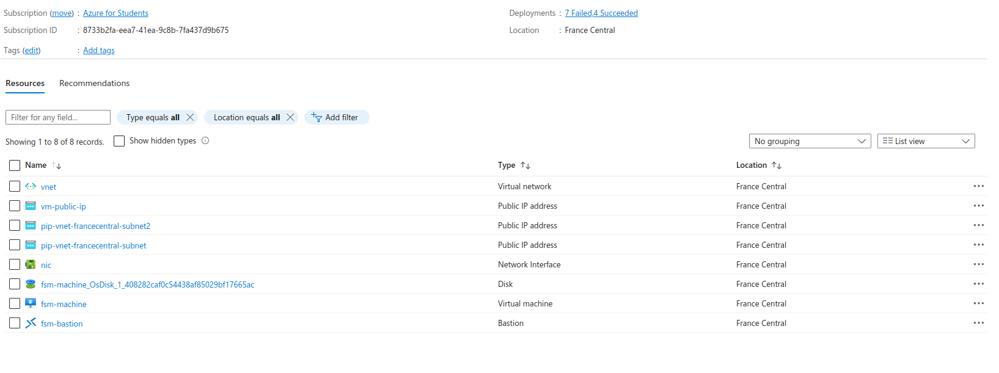

# Terraform Deployment Guide

This guide provides instructions on how to create a Terraform virtual machine (VM) on Microsoft Azure.

## Prerequisites

Before you begin, ensure you have the following:

- [Terraform](https://www.terraform.io/downloads.html) installed on your local machine.
- An active Microsoft Azure account.
- SSH access to the virtual machine.

## Terraform Setup

1. Clone or download the repository containing the Terraform configuration files.

2. Navigate to the directory containing the Terraform configuration files.

3. Initialize Terraform by running the following command:

   ```bash
   terraform init
   ```

4. Review and customize the `variables.tf` file to set your Azure credentials and other configuration parameters.

5. Deploy the virtual machine by running the following command:

   ```bash
   terraform apply
   ```

   Follow the prompts and confirm the deployment. Terraform will create the virtual machine based on the specified configuration.

6. Once the deployment is complete, note down the public IP address of the virtual machine.

---
## List of Resources
This table lists various resources along with their types and locations. 

| NAME                                  | TYPE                | LOCATION       |
|---------------------------------------|---------------------|----------------|
| vnet                                  | Virtual network     | France Central |
| vm-public-ip                          | Public IP address   | France Central |
| pip-vnet-francecentral-subnet2       | Public IP address   | France Central |
| pip-vnet-francecentral-subnet        | Public IP address   | France Central |
| nic                                   | Network Interface   | France Central |
| fsm-machine_OsDisk_1_408282caf0c54438af85029bf17665ac | Disk    | France Central |
| fsm-machine                           | Virtual machine     | France Central |
| fsm-bastion                           | Bastion             | France Central |



## Azure Bastion and Virtual Machine Setup Documentation

## Overview

This documentation provides instructions on setting up an Azure environment with a Bastion host and a Linux virtual machine.

### Resources Created

1. **Azure Bastion Host (bastion):**
   - Name: bastion-host
   - Location: France Central
   - Public IP Address: Associated with the public IP created for the virtual machine (`azurerm_public_ip.vm_public_ip`).

2. **Azure Virtual Network (vnet):**
   - Name: vnet
   - Address Space: 10.0.0.0/16
   - Location: France Central
   - Subnet: subnet
      - Name: subnet
      - Address Prefixes: 10.0.2.0/24

3. **Azure Network Interface (nic):**
   - Name: nic
   - Location: France Central
   - IP Configuration:
      - Name: internal
      - Subnet: subnet (from `azurerm_subnet.subnet` resource)
      - Private IP Address Allocation: Dynamic

4. **Azure Linux Virtual Machine (vm):**
   - Name: fsm-machine
   - Location: France Central
   - Size: Standard_F2
   - Admin Username: adminuser
   - SSH Key: Public key from `~/.ssh/id_rsa.pub`
   - OS Disk:
      - Caching: ReadWrite
      - Storage Account Type: Standard_LRS
   - Source Image Reference:
      - Publisher: Canonical
      - Offer: 0001-com-ubuntu-server-jammy
      - SKU: 22_04-lts
      - Version: Latest

## Terraform Configuration

The Terraform configuration is split into several resource blocks, each responsible for creating a specific Azure resource.

### Provider Configuration

The Terraform provider configuration specifies the Azure provider and version.

### Variables

Two variables are defined to customize the deployment

These variables control the resource group name and Azure region.

### Public IP Address

A static public IP address is created for the virtual machine.

### Virtual Network

The virtual network is defined with a specific address space and a subnet.

### Network Interface

The network interface is created, linked to the subnet, and configured with a dynamic private IP address.

### Azure Bastion Host

The Bastion host is set up using the public IP address created for the virtual machine.

### Linux Virtual Machine

The Linux virtual machine is configured with the specified settings, where to run the app


